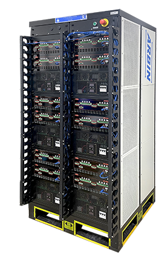
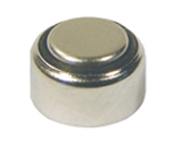
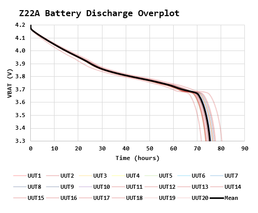
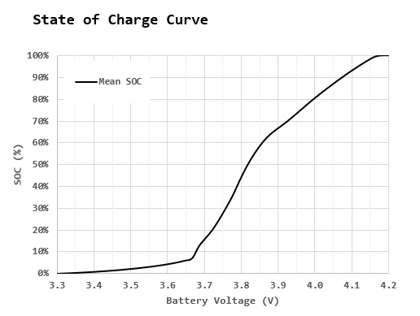

  

 
<h3 align=center>Analyzing Data Gathered From an Arbin Battery Tester</h2>
<h4 align=center>This repo contains my Power Query work on analyzing battery SOC data from a large number of batteries.</h3>
 

# Abstract

I have used Power Query to analyze limited amounts of battery data (>=6 batteries) gathered using a Maccor battery tester, which I had programmed to deliver the minimum amount of data. A coworker has been using the Arbin battery tester and he asked me to analyze his data. He has configured to provide a large amount of data over a large period of time on 20 batteries. The Arbin generates one file for each battery that is ~25 MB for a total of ~500 MB.

Here is my summary of how Power Query and Excel did with the data relative to Python and Pandas:

- Power Query and Excel is very slow. I was quite surprised at how slow the processing was. I did not measure the time, but it had to be >10x slower than Python and Pandas. I am going to guess that this is driven by the size of data files because I did not see the difference in speed when the total amount of data was a factor of 10 less.
- Power Query's main advantage is the ability to see the data transformations live. I find this the same advantage that Excel has for small data sets.
- Overplotting the data was painful with Excel. I personally like to work with data tables in long format (non-tidy). Excel is clumsy with plotting data directly in this format. This means that I have to have an additional stage of transformation in order to conveniently plot the data.

# Background

## Battery

The test data was from a standard lithium-ion coin cell. I show a similar device below.

A test fixture was built that held all twenty units.

## Load Profile

### Charge

The batteries were charged using a simple algorithm:

- Constant Current: 10 mA
- Constant Voltage: 4.2 V
- Termination Current: 1 mA

### Discharge

The batteries were discharged using a constant current of 0.67 mA.

# Analysis

## Graphical Analysis of Discharge Curve

### Discharge Curve

My objective with this testing was to determine the mean discharge curve for the 20 units under test. The curve is shown below.

The man curve was the focus of this test. I used it to generate the SOC curve for this battery.

### SOC Curve

Given the mean discharge curve, we can determine the mean SOC.

## Observations

The key points to take from this plot are:

- The mean run time is ~76 hours.
- The operating time varies from 72 hours to 80 hours.
- So I am going to say the run time is 76 ± 4 hours.
- The level of variation is ±5%.
